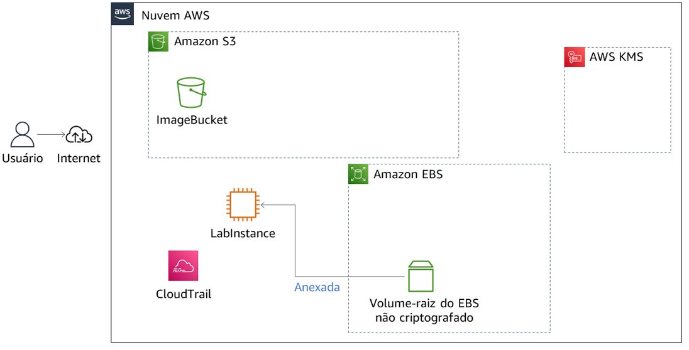
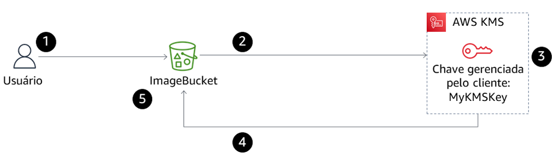
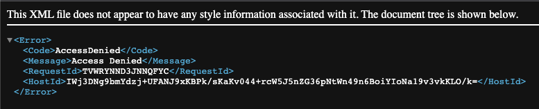
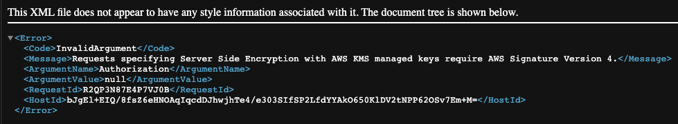
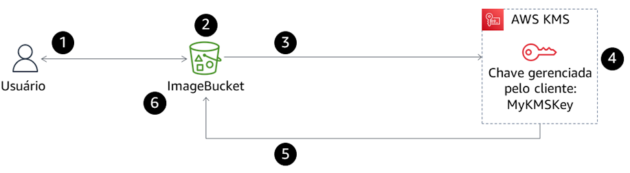
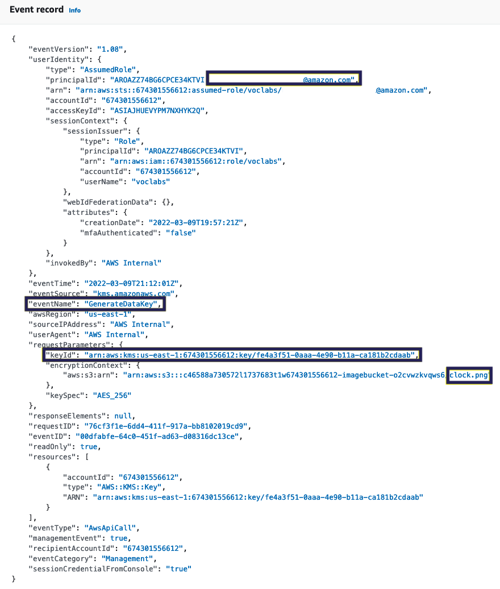
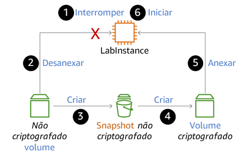
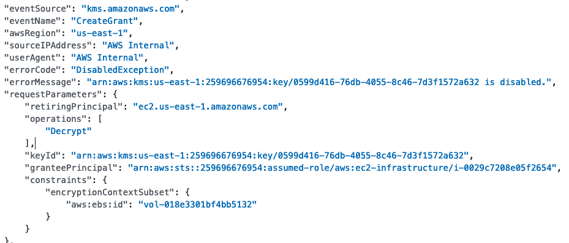
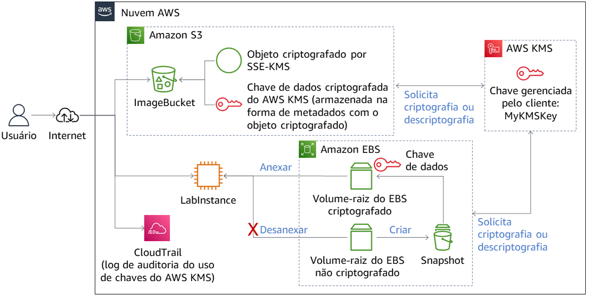

{\rtf1\ansi\ansicpg1252\cocoartf2868
\cocoatextscaling0\cocoaplatform0{\fonttbl\f0\fswiss\fcharset0 Helvetica;}
{\colortbl;\red255\green255\blue255;}
{\*\expandedcolortbl;;}
\paperw11900\paperh16840\margl1440\margr1440\vieww11520\viewh8400\viewkind0
\pard\tx720\tx1440\tx2160\tx2880\tx3600\tx4320\tx5040\tx5760\tx6480\tx7200\tx7920\tx8640\pardirnatural\partightenfactor0

\f0\fs24 \cf0 # AWS KMS Encryption Lab\
\
This project demonstrates how to secure data at rest using AWS Key Management Service (KMS).\
\
The lab includes encryption for:\
\
- Amazon S3 objects\
- Amazon EC2 root volumes (EBS)\
- CloudTrail auditing\
- Key lifecycle impact on access\
\
\
\
## Initial Architecture\
\
The lab environment starts with an EC2 instance and an S3 bucket.\
\
\
\
\
\
## Uploading an Encrypted Object to S3\
\
The image was uploaded using SSE-KMS encryption.\
\
\
\
\
\
## Public Access Attempt\
\
Even after making the object public, access is denied.\
\
\
\
\
\
## Access without Signature\
\
Requests without AWS Signature v4 fail.\
\
\
\
\
\
## Authenticated Access\
\
When accessed via AWS Console, the object is decrypted.\
\
\
\
\
\
## CloudTrail Logging\
\
CloudTrail records the use of the KMS key.\
\
\
\
\
\
## Encrypting the EC2 Root Volume\
\
Process used to encrypt an existing root volume:\
\
\
\
\
\
## Key Disabled Impact\
\
Disabling the KMS key prevents access to encrypted resources.\
\
\
\
\
\
## Final Architecture\
\
After encryption:\
\
- S3 object encrypted\
- EC2 root volume encrypted\
- KMS manages keys\
- CloudTrail logs usage\
\
\
\
\
\
## Sample Encryped Object\
\
\
\
\
\
## Security Concepts Demonstrated\
\
- AWS KMS encryption\
- Encryption at rest\
- Envelope encryption\
- Key lifecycle impact\
- CloudTrail auditing\
- Secure access control\
\
\
\
## Skills Demonstrated\
\
- AWS KMS key management\
- S3 SSE-KMS encryption\
- EBS encryption migration\
- CloudTrail auditing\
- Cloud security best practices\
}